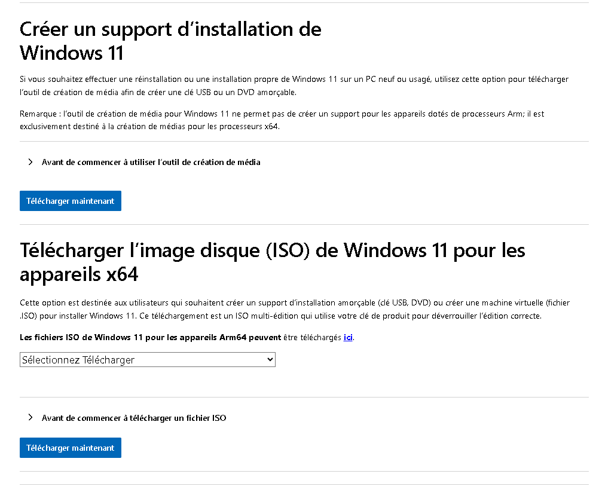
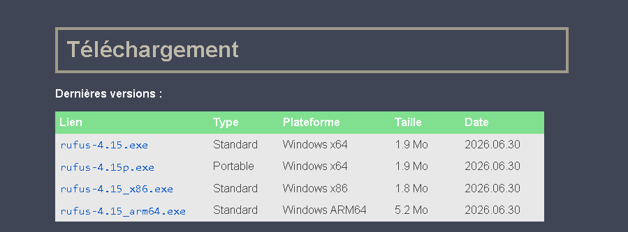
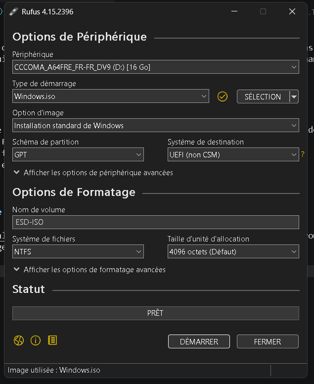
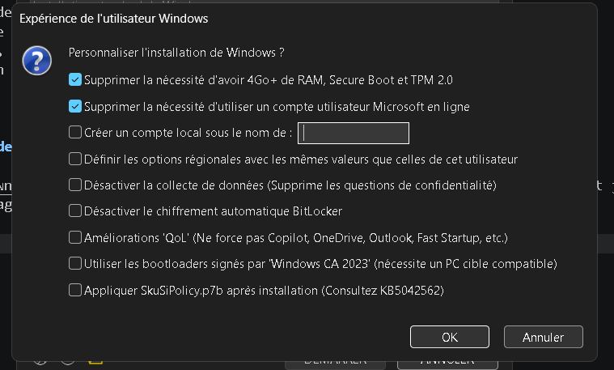

# Guide d'installation : Windows 11 sur PC non compatible

Ce tutoriel explique étape par étape l'installation et la configuration de Windows 11 sur un ordinateur qui ne répond pas aux exigences matérielles officielles de Microsoft. 

L'objectif de ce guide est de permettre à n'importe qui de donner une seconde vie à un ancien ordinateur en contournant facilement ces restrictions à l'aide de l'outil **Rufus**.

---

## Sommaire
- [1. Téléchargement de l'ISO officiel de Windows 11 et de Rufus](#1-Téléchargement-de-l'ISO-officiel-de-Windows-11-et-de-Rufus)
- [2. Configuration de Rufus et activation du bypass des restrictions](#2-Configuration-de-Rufus-et-activation-du-bypass-des-restrictions)
- [3. Démarrage sur la clé USB, formatage et configuration initiale](#3-Démarrage-sur-la-clé-USB,-formatage-et-configuration-initiale)
- [4. Réutilisation d'une ancienne clé (Windows 10)](#4-réutilisation-dune-ancienne-clé-windows-10)

---

## 1. Téléchargement de l'ISO officiel de Windows 11 et de Rufus

1. Rendez-vous sur la page officielle de Microsoft : [Télécharger Windows 11](https://www.microsoft.com/fr-ca/software-download/windows11).

> [!CAUTION]
> **Attention à l'architecture de votre processeur :**
> Assurez-vous de télécharger la version pour processeurs sous peine d'avoir un message d'erreur d'incompatibilité au démarrage de la clé USB.



2. Rendez-vous sur le site officiel de Rufus : [rufus.ie](https://rufus.ie/fr/) et téléchargez la dernière version du logiciel.



---

## 2. Configuration de Rufus et activation du bypass des restrictions

> [!WARNING]
> **Sauvegarde de la clé USB :**
> L'utilisation de Rufus effacera l'intégralité des données présentes sur la clé USB sélectionnée. Assurez-vous qu'elle ne contient aucun fichier important.

1. Insérez une clé USB d'au moins **8 Go** dans votre ordinateur.
2. Lancez le logiciel Rufus.
3. Dans la liste déroulante Périphérique, sélectionnez votre clé USB.
4. Dans la section Type de démarrage, cliquez sur SÉLECTION et choisissez le fichier ISO de Windows 11 (`.iso`) téléchargé précédemment.
5. Sélectionnez le Schéma de partition GPT/UEFI.



6. Cliquez sur DÉMARRER.
7. Une fenêtre Personnalisation de l'installation de Windows apparaît alors.
8. Cochez impérativement la case :
   - `Supprimer le besoin de 4 Go+ de RAM, Secure Boot et TPM 2.0`
9. Configurez les autres options selon vos préférences (par exemple : sauter l'obligation de créer un compte Microsoft ou désactiver la collecte de données).



10. Validez en cliquant sur OK et patientez jusqu'à la fin de la création du support bootable.

---

## 3. Démarrage sur la clé USB, formatage et configuration initiale

1. Éteignez l'ordinateur cible et insérez la clé USB d'installation.

2. Démarrez votre appareil et et appuyez immédiatement sur la touche d'accès au Boot Menu. Si nécessaire, consultez ce [guide des touches accès BIOS/Boot Menu](http://www.auditiait.es/en/list-of-keys-to-access-to-bios/) pour savoir quel touche pour rentrer dans le menu de demarrage. 

3. Utilisez les touches flèches pour naviguer vers votre USB bootable et appuyez sur Entrée pour la sélectionner.

4. L'assistant d'installation Windows démarre. Suivez les étapes initiales jusqu'au choix du type d'installation.

5. Sélectionnez Personnalisée : Installer uniquement Windows (avancé).

> [!WARNING]
> **Attention à vos données :**
>**Toutes les données du disque seront définitivement effacées.** Pour garantir une installation propre, sélectionnez chaque partition du disque principal (Disque 0) et cliquez sur Supprimer. Une fois tout le disque affiché comme *Espace non alloué*, cliquez sur Suivant.

---

## 4. Réutilisation d'une ancienne clé (Windows 10)

Avant d'acheter une nouvelle clé de produit, vérifiez les conditions suivantes :

* **Mise à niveau depuis Windows 10 :** Si l'ordinateur était déjà activé sous Windows 10, Windows 11 s'activera automatiquement dès la première connexion Internet grâce à la licence numérique associée à votre carte mère.
* **Nouvelle installation :** Si le PC n'a jamais eu de licence numérique Windows 10/11, l'achat d'une clé de licence valide sera requis.

Pour connaître votre clé de licence actuelle (si stockée dans la carte mère):
1. Appuyez sur les touches Windows + S pour ouvrir la recherche.
2. Tapez PowerShell, faites un clic droit dessus et choisissez Exécuter en tant d'administrateur.
3. Copiez et collez la commande suivante, puis appuyez sur Entrée : 
```Powershell
(Get-CimInstance -ClassName SoftwareLicensingService).OA3xOriginalProductKey
```
*Guide rédigé et maintenu par Jade Lachapelle.*